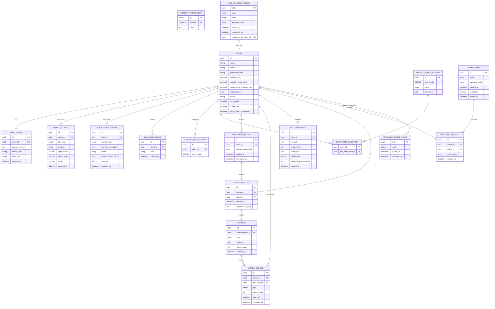

```mermaid
erDiagram
    CLIENT {
        uuid id PK
        string name
        string email
        string password_hash
        decimal balance_usd
        decimal monthly_usage_limit
        decimal usage_alert_threshold_usd
        uuid widget_token
        string status
        datetime last_active
        datetime created_at
        boolean widget_setup_dismissed
    }

    BOT_CONFIG {
        uuid id PK
        uuid client_id FK
        text system_prompt
        string default_role
        string tone_style
        datetime updated_at
    }

    WIDGET_CONFIG {
        uuid id PK
        uuid client_id FK
        string bot_name
        string position
        JSONB light_colors
        JSONB dark_colors
        JSONB icons
        datetime updated_at
    }

    BLACKLIST_WORD {
        uuid id PK
        uuid client_id FK
        string word
        datetime created_at
    }

    CUSTOM_MCP_SERVER {
        uuid id PK
        uuid client_id FK
        JSONB mcp_config
    }

    PRE_MADE_MCP_SERVER {
        uuid id PK
        JSONB mcp_config
        string name
        text description
    }

    CLIENT_PRE_MADE_MCP {
        uuid client_id FK
        uuid pre_made_mcp_id FK
    }

    END_USER_SESSION {
        uuid id PK
        uuid client_id FK
        string browser_session_id
        datetime created_at
        datetime last_active_at
    }

    CONVERSATION {
        uuid id PK
        uuid session_id FK
        uuid client_id FK
        datetime started_at
        int satisfaction_rating
    }

    FILE_EMBEDDING {
        uuid id PK
        uuid client_id FK
        text file_path
        int chunk_index
        text chunk_text
        vector embedding
        int embedding_dimensions
        datetime created_at
    }

    MESSAGE {
        uuid id PK
        uuid conversation_id FK
        enum role
        text content
        int token_count
        datetime created_at
    }

    USAGE_RECORD {
        uuid id PK
        uuid client_id FK
        uuid message_id FK
        enum type
        int tokens_used
        decimal cost_usd
        datetime recorded_at
    }

    ADMIN_USER {
        uuid id PK
        string email
        string password_hash
        datetime created_at
        boolean is_deleted
        datetime deleted_at
    }

    ADMIN_ACCESS_LOG {
        uuid id PK
        uuid admin_id FK
        uuid client_id FK
        string action_type
        datetime created_at
    }

    AI_PROVIDER_CONFIG {
        uuid id PK
        uuid client_id FK
        enum provider_type
        text api_key_encrypted
        string model
        string embedding_model
        text base_url
        datetime updated_at
    }

    WIDGET_IP_RATE_LIMIT {
        string ip PK
        datetime window PK
        int count
    }

    PENDING_REGISTRATION {
        uuid token PK
        string name
        string email
        string password_hash
        datetime expires_at
        datetime consumed_at
        uuid consumed_by_client_id FK
    }

    PASSWORD_RESET_TOKEN {
        uuid token PK
        string email
        datetime expires_at
        datetime consumed_at
    }

    CLIENT ||--|| BOT_CONFIG : has
    CLIENT ||--|| WIDGET_CONFIG : configures
    CLIENT ||--o| AI_PROVIDER_CONFIG : configures
    CLIENT ||--o{ BLACKLIST_WORD : defines
    CLIENT ||--o{ CUSTOM_MCP_SERVER : configures
    CLIENT ||--o{ CLIENT_PRE_MADE_MCP : ""
    PRE_MADE_MCP_SERVER ||--o{ CLIENT_PRE_MADE_MCP : ""
    CLIENT ||--o{ END_USER_SESSION : receives
    CLIENT ||--o{ USAGE_RECORD : generates
    CLIENT ||--o{ FILE_EMBEDDING : embeds
    CLIENT ||--o{ CONVERSATION : ""

    END_USER_SESSION ||--o{ CONVERSATION : contains
    CONVERSATION ||--o{ MESSAGE : includes
    MESSAGE ||--o{ USAGE_RECORD : tracks

    ADMIN_USER ||--o{ ADMIN_ACCESS_LOG : performs
    CLIENT o|--o{ ADMIN_ACCESS_LOG : target
    PENDING_REGISTRATION ||--o| CLIENT : becomes
    CLIENT ||--o{ PASSWORD_RESET_TOKEN : "requests (by email)"

```