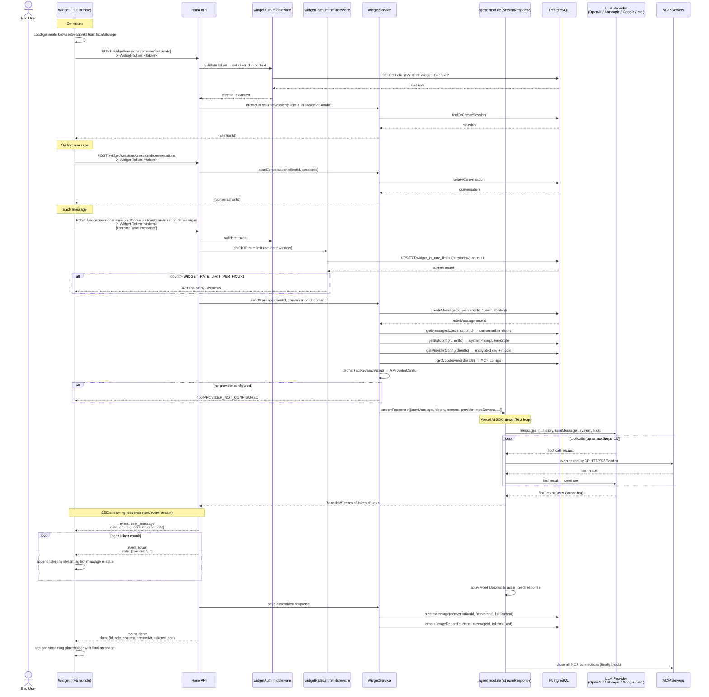

# Agent Integration Design

**Date:** 2026-04-20
**Branch:** SCRUM-76-agent
**Scope:** Wire the widget to the API with real LLM responses, add SSE streaming, IP-based rate limiting, and add a platform-level default LLM provider via environment variables.

---

## Overview

Four interconnected changes:

1. **Widget ↔ API contract** — replace the widget's fake `setTimeout` response with real API calls; fix auth to use `widgetToken`; simplify URL structure
2. **API LLM integration** — wire `widget.service.ts#sendMessage` to the agent module with full conversation history; stream tokens via SSE; record token usage
3. **IP rate limiting** — Postgres-backed per-IP hourly message cap on the message send endpoint
4. **Default LLM provider** — platform-level fallback provider configured via env vars; clients who have not set up their own provider use it automatically

---

## Section 1: Widget ↔ API Contract

### Auth — widget config rename + dashboard fixes

The current `WidgetConfig.clientId` field is misleading — it implies the DB primary key UUID, but what the widget needs for authentication is the `widgetToken` credential. Rename the field:

```ts
// packages/widget/src/types.ts
interface WidgetConfig {
  widgetToken: string  // was: clientId
  apiUrl: string
  // ... rest unchanged
}
```

The `widgetToken` is the existing `clients.widget_token` UUID already in the schema. Customers copy it from their dashboard. It is intentionally separate from `clientId` (the DB PK) so it can be rotated independently without affecting foreign key relationships.

**Critical bug to fix — the embed snippet currently uses the wrong credential:**
`EmbedCodeCard.tsx` currently puts `client.data.id` (the DB primary key) into the snippet as `clientId`. However `clientResponseSchema` in `packages/db/src/dto/client.dto.ts` explicitly omits `widgetToken`, so the dashboard never receives it. The `widgetAuth` middleware validates `X-Widget-Token` against `clients.widget_token` — a different UUID entirely — meaning the generated snippet would always fail authentication.

**Fixes required:**

1. **`packages/db/src/dto/client.dto.ts`** — expose `widgetToken` in `clientResponseSchema`:
   ```ts
   // Remove widgetToken from the omit list — it is a customer-facing credential
   .omit({ passwordHash: true })  // was: .omit({ passwordHash: true, widgetToken: true })
   ```

2. **`apps/web/src/components/widget/setup/EmbedCodeCard.tsx`** — update props and config object:
   - Replace `clientId: string | undefined` prop with `widgetToken: string | undefined`
   - In `configObject`, use `widgetToken` instead of `clientId`
   - Update the `WidgetSetup.tsx` caller to pass `client?.data?.widgetToken` instead of `client?.data?.id`

3. **Widget token rotation** — new endpoint `POST /client/me/widget-token/rotate`:
   - Generates a new random UUID and updates `clients.widget_token`
   - Returns `{ widgetToken: string }`
   - Protected by `clientAuth` (existing JWT middleware)
   - In the UI: a "Rotate Token" button in `EmbedCodeCard` with a destructive confirmation dialog warning that all existing embeds will stop working until updated

Every widget API request includes:
```
X-Widget-Token: <widgetToken>
```

The existing `widgetAuth` middleware handles this correctly — no other server-side auth changes needed.

### URL simplification

The current prefix `/widget/:clientId/sessions` includes a `clientId` path param that no route handler actually reads (all handlers use `c.get("clientId")` set by the auth middleware). Remove it.

Files affected: `apps/api/src/modules/widget/widget.routes.ts`, `apps/api/src/app.ts`.

| Before | After |
|---|---|
| `POST /widget/:clientId/sessions` | `POST /widget/sessions` |
| `POST /widget/:clientId/sessions/:sessionId/conversations` | `POST /widget/sessions/:sessionId/conversations` |
| `DELETE /widget/:clientId/sessions/:sessionId/conversations/:conversationId` | `DELETE /widget/sessions/:sessionId/conversations/:conversationId` |
| `PATCH /widget/:clientId/sessions/:sessionId/conversations/:conversationId` | `PATCH /widget/sessions/:sessionId/conversations/:conversationId` |
| `GET /widget/:clientId/sessions/:sessionId/conversations/:conversationId/messages` | `GET /widget/sessions/:sessionId/conversations/:conversationId/messages` |
| `POST /widget/:clientId/sessions/:sessionId/conversations/:conversationId/messages` | `POST /widget/sessions/:sessionId/conversations/:conversationId/messages` |

### Widget session lifecycle

The widget manages session and conversation state internally. `useWidget.ts` gains two new required options:

```ts
interface UseWidgetOptions {
  apiUrl: string       // ← new
  widgetToken: string  // ← new
  // ... rest unchanged
}
```

These are passed down from `EmbeddedWidget.tsx` via the `config` prop (which already holds both values).

**Lifecycle:**
1. **On mount:** generate `browserSessionId` UUID if not in `localStorage` (key: `talqo:widget:session`). Call `POST /widget/sessions` with `{ browserSessionId }` → store returned `sessionId` in component state.
2. **On first message send:** call `POST /widget/sessions/:sessionId/conversations` → store `conversationId` in state.
3. **Subsequent messages:** `POST .../messages` — returns SSE stream.

Note: conversations are always newly created per widget load (sessions are resumed by `browserSessionId`, but conversations are not). History continuity across page reloads is out of scope for this iteration.

### Conversation reset ("Clear" button)

The widget's clear button creates a **new conversation** via `POST /widget/sessions/:sessionId/conversations` and resets local message state to the welcome message. The previous conversation is **never deleted from the database** — it stays intact for analytics.

The existing `DELETE /widget/sessions/:sessionId/conversations/:conversationId` endpoint is removed from widget-facing routes. `WidgetService.resetConversation` and `WidgetRepository.deleteConversation` are no longer called by the widget. The widget's `clearMessages` hook method remains as `clearMessages` in `UseWidgetReturn`.

---

## Section 2: API LLM Integration + SSE Streaming

### Agent module — `streamResponse`

Add a new `streamResponse` function in `apps/api/src/modules/agent/agent.service.ts` alongside the existing `generateResponse`. It uses `streamText` instead of `generateText` and returns a `ReadableStream<string>` of token chunks.

`AiServiceInput` gains an optional `history` field for multi-turn context:

```ts
// agent.types.ts — import type { ModelMessage } from "ai" (verbatimModuleSyntax: use import type)
export type AiServiceInput = {
  userMessage: string
  history?: ModelMessage[]     // ← new, optional — defaults to [] inside the function
  context: string
  wordBlacklist: string[]
  mcpServers: McpServerConfig[]
  contextDirectory: string
  provider: AiProviderConfig
  maxSteps?: number
}
```

`history` is optional so `generateResponse` callers require no changes. Existing tests are unaffected.

### Widget service — `sendMessage`

Replace the placeholder in `widget.service.ts#sendMessage`.

**Constructor change:** `WidgetService` currently accepts only `WidgetRepository`. It now also accepts `BotConfigRepository`, `ProviderConfigRepository`, and `McpRepository`. Update `apps/api/src/modules/widget/index.ts` to instantiate and inject all four.

**Updated `sendMessage` flow:**

1. Verify conversation exists (already done — throws `NotFoundError` if missing)
2. Count existing messages for the conversation via `WidgetRepository.getMessageCount(conversationId)`. If `count >= config.WIDGET_CONVERSATION_MAX_MESSAGES`, throw `BadRequestError("CONVERSATION_LIMIT_REACHED", "Conversation limit reached — please start a new conversation")`
3. Save user message to DB → get `userMessage` record
4. Fetch provider config via `ProviderConfigRepository.getByClientId(clientId)`. If `null`, fall back to the platform default provider from `config` (see Section 4). If neither is set, throw `BadRequestError("PROVIDER_NOT_CONFIGURED", "No AI provider configured")`
5. Decrypt API key if from DB: `decrypt(providerConfig.apiKeyEncrypted, config.PROVIDER_KEY_SECRET)` → build `AiProviderConfig`. If using the default provider, build `AiProviderConfig` directly from config (no decryption needed — key is already plaintext in env)
6. Fetch bot config via `BotConfigRepository.getByClientId(clientId)` → build system string:
   ```
   <systemPrompt if set>
   Tone: <toneStyle if set>
   ```
   If both are null/empty, pass an empty string for `context`.
7. Fetch MCP server configs via `McpRepository.getClientServers(clientId)` → convert to `McpServerConfig[]`
8. Fetch conversation message history via `WidgetRepository.getMessages(conversationId, clientId)` → convert to `ModelMessage[]` (`role: "assistant"` and `role: "user"` passed directly, `role: "system"` is skipped)
9. Call `streamResponse({ userMessage: content, history: priorMessages, context, provider, mcpServers, contextDirectory: "", wordBlacklist, maxSteps: 10 })`
   - `contextDirectory: ""` — file tools are disabled for widget; `createContextTools` must guard against empty string and return `{}` in that case
10. Accumulate streamed tokens; on stream end, save assembled assistant message to DB
11. Record token usage in `usageRecords` table (existing usage recording pattern)
12. Return `{ stream, userMessageRecord }` to the route handler

### Agent module — `createContextTools` guard

Add an early return in `createContextTools` when `contextDirectory` is empty:

```ts
export async function createContextTools(contextDirectory: string) {
  if (!contextDirectory) return {}
  // ... existing implementation
}
```

### Widget route — SSE response

The `POST .../messages` route switches to `text/event-stream`. Use Hono's `streamSSE` helper.

**Event sequence:**

```
event: user_message
data: {"id":"...","role":"user","content":"...","createdAt":"..."}

event: token
data: {"content":"Hello"}

event: token
data: {"content":" world"}

event: done
data: {"id":"...","role":"assistant","content":"Hello world","createdAt":"...","tokensUsed":{"input":10,"output":5}}
```

On LLM error after streaming has started:
```
event: error
data: {"code":"LLM_ERROR","message":"..."}
```

Pre-stream errors (404 conversation not found, 429 rate limit) are returned as standard JSON before the stream opens — these keep the existing JSON error response shape from `errorHandler`.

The OpenAPI spec documents this route with `200 text/event-stream` (described as a string schema) alongside the existing `404`/`429` JSON error responses.

### Widget `useWidget.ts` — streaming state

`sendMessage` uses `fetch` with a manual SSE line parser over the response `ReadableStream` (`ReadableStreamDefaultReader`) — no extra library needed. `EventSource` is GET-only and cannot be used.

**SSE parsing:** split each chunk on `\n`, parse `event:` and `data:` lines, emit typed events.

**State handling:**
- **`user_message` event:** append user message to `messages` state (role `"user"`)
- **`token` event:** append to an in-progress assistant message entry (role `"assistant"`) in state, streaming placeholder with id prefixed `stream-`
- **`done` event:** replace the streaming placeholder with the final persisted message (role `"assistant"`)
- **`error` event:** mark the streaming message as failed and remove any messages whose id startsWith `"stream-"` from the messages state, then set `isTyping(false)`

**Interface:**
- `isTyping` remains in `UseWidgetReturn` — no rename to `isStreaming`
- `clearMessages` remains in `UseWidgetReturn` — creates a new conversation via the API, resets local message state to welcome message
- `EmbeddedWidget.tsx` and `WidgetTypingIndicator.tsx` use `widget.isTyping` directly

Note: the widget `Message` type uses `role: "user" | "assistant"` directly. No role mapping is needed.

---

## Section 3: IP Rate Limiting

### Schema

New Drizzle table in `packages/db/src/schema/rate-limits.ts` (export from schema `index.ts`):

```ts
export const widgetIpRateLimits = pgTable("widget_ip_rate_limits", {
  ip: varchar("ip", { length: 45 }).notNull(),     // supports IPv6
  window: timestamp("window", { withTimezone: true }).notNull(), // truncated to hour
  count: integer("count").notNull().default(0),
}, (table) => [
  primaryKey({ columns: [table.ip, table.window] }),
])
```

Run `bun run db:generate` after adding the schema to produce the migration SQL.

### Middleware

New `widgetRateLimit` middleware in `apps/api/src/common/middleware/widget-rate-limit.ts`:

1. Extract IP via `getConnInfo(c)` for the direct connection address. Read `X-Forwarded-For` header and validate the leftmost IP with `node:net.isIP`. If the direct connection comes from a trusted proxy (explicitly configured in `config.TRUSTED_PROXY_IPS` **or** auto-detected as a private/internal IP such as `10.x`, `172.16-31.x`, `192.168.x`, `127.x`), the validated forwarded IP is used as the real client IP for rate limiting; otherwise the direct connection IP is used.
2. Truncate current time to the hour: `new Date(Math.floor(Date.now() / 3_600_000) * 3_600_000)`
3. Atomic upsert: `INSERT ... ON CONFLICT (ip, window) DO UPDATE SET count = count + 1 RETURNING count`
4. If returned `count > config.WIDGET_RATE_LIMIT_PER_HOUR` → throw `TooManyRequestsError`
5. Probabilistic stale-window cleanup: on ~1% of requests, delete rows older than 24 hours (`DELETE FROM widget_ip_rate_limits WHERE window < cutoff`). No per-request per-IP DELETE.

Applied **only** to `POST .../messages` — not to session or conversation routes.

### New error class

Add to `apps/api/src/common/errors.ts`:

```ts
export class TooManyRequestsError extends AppError {
  constructor(message = "Too many requests") {
    super(429, "TOO_MANY_REQUESTS", message)
  }
}
```

### Config

Add to `apps/api/src/common/config.ts` Zod schema:

```ts
WIDGET_RATE_LIMIT_PER_HOUR: z.coerce.number().int().positive().default(60),
WIDGET_CONVERSATION_MAX_MESSAGES: z.coerce.number().int().positive().default(50),
```

---

## Section 4: Default LLM Provider via Environment Variables

A platform-level default LLM provider is configured via environment variables. Clients who configure their own provider in the dashboard override this default; clients who have not configured anything use it automatically.

### New env vars — `.env.example`

Add to the root `.env.example`:

```sh
# Widget rate limiting
WIDGET_RATE_LIMIT_PER_HOUR=60
# Max messages per conversation before the user must start a new one (counts both user + assistant messages)
WIDGET_CONVERSATION_MAX_MESSAGES=50

# Default LLM provider — used when a client has not configured their own provider.
# Supports any provider type the API supports (openai, anthropic, google, openai_compatible).
# Leave all DEFAULT_LLM_* vars unset to require each client to configure their own.
DEFAULT_LLM_PROVIDER_TYPE=openai
DEFAULT_LLM_API_KEY=sk-your-key-here
DEFAULT_LLM_MODEL=gpt-4o-mini
# Only required when DEFAULT_LLM_PROVIDER_TYPE=openai_compatible
DEFAULT_LLM_BASE_URL=
```

### `apps/api/src/common/config.ts`

Add to the Zod schema (all optional — if any are missing, default provider is disabled):

```ts
DEFAULT_LLM_PROVIDER_TYPE: z.enum(["openai", "openai_compatible", "google", "anthropic"]).optional(),
DEFAULT_LLM_API_KEY: z.string().optional(),
DEFAULT_LLM_MODEL: z.string().optional(),
DEFAULT_LLM_BASE_URL: z.string().url().optional(),
```

Build a helper in config (or inline in the service) that constructs an `AiProviderConfig` from these vars, returning `null` if any required field is missing.

### Helm — `templates/api-deployment.yaml`

Add optional env vars for the default provider (sourced from a secret when set):

```yaml
- name: WIDGET_RATE_LIMIT_PER_HOUR
  value: {{ .Values.api.widgetRateLimitPerHour | default 60 | quote }}
- name: WIDGET_CONVERSATION_MAX_MESSAGES
  value: {{ .Values.api.widgetConversationMaxMessages | default 50 | quote }}
{{- if .Values.api.defaultLlm.existingSecret }}
- name: DEFAULT_LLM_PROVIDER_TYPE
  valueFrom:
    secretKeyRef:
      name: {{ .Values.api.defaultLlm.existingSecret }}
      key: providerType
- name: DEFAULT_LLM_API_KEY
  valueFrom:
    secretKeyRef:
      name: {{ .Values.api.defaultLlm.existingSecret }}
      key: apiKey
- name: DEFAULT_LLM_MODEL
  valueFrom:
    secretKeyRef:
      name: {{ .Values.api.defaultLlm.existingSecret }}
      key: model
- name: DEFAULT_LLM_BASE_URL
  valueFrom:
    secretKeyRef:
      name: {{ .Values.api.defaultLlm.existingSecret }}
      key: baseUrl
      optional: true
{{- end }}
```

Add to `values.yaml` under `api:`:

```yaml
api:
  # ... existing fields
  # Max widget messages per IP per hour
  widgetRateLimitPerHour: 60
  # Max messages per conversation before the user must start a new one
  widgetConversationMaxMessages: 50
  # Optional platform-level default LLM provider (clients can override per-account)
  defaultLlm:
    existingSecret: ""
```

---

## Section 5: Testing

Per project convention, tests are co-located with features (`*.test.ts`).

| Test file | What to cover |
|---|---|
| `apps/api/src/modules/agent/agent.service.test.ts` | `streamResponse`: tokens emitted correctly, blacklist applied, MCP closed in finally |
| `apps/api/src/modules/widget/widget.service.test.ts` | `sendMessage` with real LLM stub: user message saved, assistant message saved, usage recorded, `PROVIDER_NOT_CONFIGURED` error when config missing, `CONVERSATION_LIMIT_REACHED` when at max messages |
| `apps/api/src/common/middleware/widget-rate-limit.test.ts` | Under limit: passes; at limit: passes; over limit: 429; different IPs: independent counters |
| `apps/api/src/modules/client-account/client-account.test.ts` | `POST /client/me/widget-token/rotate`: new token differs from old, old token no longer authenticates widget routes |

Use `InMemoryRepository` variants for all service tests (existing pattern). No real DB or LLM needed.

---

## Section 6: Architecture Documentation Updates

The existing docs are outdated and must be updated as part of this implementation.

### `docs/architecture/component-diagram/enduser-request.md`

Replace entirely with an accurate end-to-end flow that reflects the real code structure:



### `docs/architecture/ERD/main-mermaid.md`

Add the new `WIDGET_IP_RATE_LIMIT` entity and remove the stale `TODO` comment:

```diff
-    %% TODO: WIDGET_CONFIG entity is not yet defined — columns TBD
+    WIDGET_IP_RATE_LIMIT {
+        varchar ip PK
+        timestamp window PK
+        int count
+    }
```

---

## Out of Scope

- Abuse via IP rotation (VPN/proxies to bypass the per-IP rate limit) — accepted risk, explicitly out of scope
- Conversation history continuity across page reloads — separate feature
- Response streaming to the client dashboard (analytics views) — separate feature
- Self-hosted LLM — out of scope; operators can configure `openai_compatible` pointing at any self-hosted endpoint independently
- Context window trimming for very long conversations — future optimization
